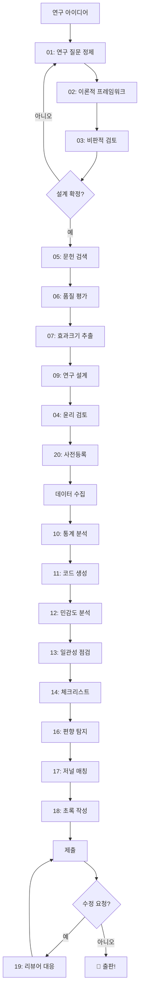

# Research Coordinator 사용 예시

## 목차

1. [연구 초기 단계](#연구-초기-단계)
2. [문헌 검토](#문헌-검토)
3. [연구 설계](#연구-설계)
4. [데이터 분석](#데이터-분석)
5. [품질 검증](#품질-검증)
6. [출판 준비](#출판-준비)
7. [전체 워크플로우](#전체-워크플로우)

---

## 연구 초기 단계

### 예시 1: 연구 질문 정제

**사용자 입력**:
```
AI 기반 학습 도구가 학습자의 학업 성취도에 미치는 영향을 연구하고 싶어요.
```

**활성화 에이전트**: 01-research-question-refiner

**출력 예시**:
```markdown
## PICO 프레임워크 분석

| 요소 | 분석 |
|------|------|
| P (Population) | 학습자 - 초중고/대학/성인? 특정 과목? |
| I (Intervention) | AI 기반 학습 도구 - 구체적 유형은? |
| C (Comparison) | 전통적 학습? AI 없는 학습? |
| O (Outcome) | 학업 성취도 - 측정 방법은? |

## 정제된 연구 질문 옵션

### 좁은 범위 (권장)
"K-12 수학 교육에서 AI 튜터링 시스템을 사용한 학생의
표준화 시험 점수가 전통적 수업만 받은 학생과 비교하여
어떻게 다른가?"

### 중간 범위
"고등교육에서 AI 학습 도구 사용이 학습자의 학업 성취도와
자기조절학습 능력에 미치는 영향은 무엇인가?"
```

---

### 예시 2: 이론적 프레임워크 설계

**사용자 입력**:
```
메타인지와 자기조절학습 이론을 기반으로 연구를 설계하고 싶어요.
```

**활성화 에이전트**: 02-theoretical-framework-architect

**출력 예시**:
```markdown
## 이론 통합 지도

### 핵심 이론 #1: 메타인지 이론 (Flavell, 1979)
- 메타인지적 지식 (선언적, 절차적, 조건적)
- 메타인지적 조절 (계획, 모니터링, 평가)

### 핵심 이론 #2: 자기조절학습 (Zimmerman, 2002)
- 사전 단계: 목표 설정, 전략 계획
- 수행 단계: 자기 모니터링
- 자기성찰 단계: 자기 평가

## 개념적 모델

```
              ┌─────────────────┐
              │  메타인지 지식   │
              └────────┬────────┘
                       ↓
    ┌──────────────────┼──────────────────┐
    ↓                  ↓                  ↓
┌───────┐         ┌───────┐         ┌───────┐
│ 계획  │ ──────→ │ 수행  │ ──────→ │ 평가  │
└───────┘         └───────┘         └───────┘
    ↑                                     │
    └─────────────────────────────────────┘
                   (피드백 루프)
```

## 가설 제안
H1: 메타인지적 지식 수준이 높을수록 자기조절학습 전략 사용이 증가한다.
H2: 자기조절학습 전략 사용은 학업 성취도에 정적 영향을 미친다.
H3: 메타인지적 지식이 자기조절학습을 매개하여 학업 성취도에 영향을 미친다.
```

---

### 예시 3: 비판적 검토 (악마의 옹호자)

**사용자 입력**:
```
이 연구 설계의 약점을 지적해주세요.
```

**활성화 에이전트**: 03-devils-advocate

**출력 예시**:
```markdown
## 🔴 비판적 검토 결과

### 내적 타당도 위협
| 위협 | 심각도 | 설명 | 대응책 |
|------|--------|------|--------|
| 선택 편향 | 🔴 높음 | 자발적 참여로 동기화된 학생 편중 | 무작위 배정, 성향점수 매칭 |
| 성숙 효과 | 🟡 중간 | 4주간 자연 발달 효과 혼입 | 통제 집단 활용 |
| 역사 효과 | 🟡 중간 | 외부 이벤트 영향 | 동시 측정, 통제 집단 |

### Reviewer 2 시뮬레이션
> "저자들은 AI 튜터링의 효과를 주장하지만,
> 구체적으로 어떤 AI 기능이 효과를 발생시키는지
> 메커니즘에 대한 설명이 부족합니다.
> 단순히 'AI 사용'과 '성과 향상' 사이의 상관만으로는
> 인과적 주장을 뒷받침하기 어렵습니다."

### 권장 사항
1. 매개 변수 추가 측정
2. 랜덤화 강화
3. 인과 언어 완화
```

---

## 문헌 검토

### 예시 4: 체계적 문헌 검색 전략

**사용자 입력**:
```
AI 기반 적응형 학습 시스템에 대한 체계적 문헌 검토를 시작하려고 해요.
```

**활성화 에이전트**: 05-systematic-literature-scout

**출력 예시**:
```markdown
## 검색 전략 (PRISMA 2020 준수)

### 데이터베이스 선정
| 데이터베이스 | 이유 | 예상 결과 |
|--------------|------|-----------|
| Web of Science | 핵심 학술 DB | ~2,000건 |
| Scopus | 넓은 커버리지 | ~2,500건 |
| ERIC | 교육 특화 | ~800건 |
| PsycINFO | 심리학 관점 | ~600건 |

### 검색식

**Web of Science**:
```
TS=(("artificial intelligence" OR "AI" OR "machine learning" OR
     "adaptive learning")
AND
("learning system*" OR "tutoring system*" OR "educational technology")
AND
("student achievement" OR "learning outcome*" OR "academic performance"))

Timespan: 2015-2024
```

### 포함/배제 기준

**포함 기준**:
- 영어 또는 한국어 출판
- 실증 연구 (실험, 준실험, 상관)
- K-16 교육 맥락
- 학업 성취 측정 포함

**배제 기준**:
- 학회 초록, 학위논문
- AI 기술 개발만 다룬 연구
- 비정규 교육 (기업 훈련 등)
```

---

### 예시 5: 효과크기 추출

**사용자 입력**:
```
이 논문에서 보고된 t(45) = 2.31, p = .025를 Cohen's d로 변환해주세요.
```

**활성화 에이전트**: 07-effect-size-extractor

**출력 예시**:
```markdown
## 효과크기 변환 결과

### 입력 정보
- t 값: 2.31
- 자유도: 45
- p-value: .025 (two-tailed)

### 변환 공식
d = 2t / √(df)
d = 2(2.31) / √45
d = 4.62 / 6.71
**d = 0.689**

### 해석
| 기준 (Cohen) | 값 | 해당 여부 |
|--------------|-----|----------|
| Small | 0.2 | ❌ |
| Medium | 0.5 | ✅ |
| Large | 0.8 | ❌ |

**결론**: 중간 효과크기 (medium effect)

### 95% 신뢰구간
d = 0.689, 95% CI [0.09, 1.29]

### 메타분석용 데이터
| 연구 | n1 | n2 | d | SE | 95% CI |
|------|----|----|---|----|----|
| Study | 23 | 24 | 0.69 | 0.30 | [0.09, 1.29] |
```

---

## 연구 설계

### 예시 6: 표본 크기 계산

**사용자 입력**:
```
두 집단 t검정을 계획하고 있어요. 검정력 .80, 알파 .05, 중간 효과크기를
가정하면 집단당 몇 명이 필요하나요?
```

**활성화 에이전트**: 09-research-design-consultant, 10-statistical-analysis-guide

**출력 예시**:
```markdown
## 표본 크기 분석

### 입력 조건
- 분석 방법: 독립 표본 t-검정
- 효과크기: d = 0.50 (medium)
- 검정력: 1 - β = .80
- 유의수준: α = .05 (양측)

### G*Power 분석 결과

```
────────────────────────────
       검정력 분석 결과
────────────────────────────
분석 유형: A priori
효과크기 d = 0.50
α 오류 확률 = 0.05
검정력 (1-β) = 0.80
────────────────────────────
집단 1 표본 = 64
집단 2 표본 = 64
총 표본 = 128
────────────────────────────
```

### 권장사항
| 시나리오 | 효과크기 | 필요 표본(집단당) | 총 표본 |
|----------|----------|-------------------|---------|
| 보수적 | d = 0.40 | 99 | 198 |
| 중간 | d = 0.50 | 64 | 128 |
| 낙관적 | d = 0.60 | 45 | 90 |

**권장**: 탈락률 15% 고려 → 집단당 **75명**, 총 **150명**
```

---

## 데이터 분석

### 예시 7: 분석 코드 생성

**사용자 입력**:
```
매개효과 분석을 위한 R 코드를 작성해주세요.
X(AI 사용 시간), M(자기효능감), Y(학업성취도)입니다.
```

**활성화 에이전트**: 11-analysis-code-generator

**출력 예시**:
```r
# ============================================
# 매개효과 분석 (Mediation Analysis)
# X: AI 사용 시간 → M: 자기효능감 → Y: 학업성취도
# Hayes PROCESS Model 4
# ============================================

# 필요 패키지
library(tidyverse)
library(lavaan)
library(mediation)

# 데이터 로드
data <- read_csv("data.csv")

# --------------------------------------------
# 방법 1: lavaan SEM (권장)
# --------------------------------------------
model_sem <- '
  # 직접 효과
  Y ~ c*X + b*M

  # a 경로 (X → M)
  M ~ a*X

  # 간접효과 및 총효과
  indirect := a*b
  total := c + (a*b)
'

fit <- sem(model_sem, data = data, se = "bootstrap", bootstrap = 5000)
summary(fit, standardized = TRUE, ci = TRUE)

# --------------------------------------------
# 방법 2: mediation 패키지
# --------------------------------------------
# Step 1: M ~ X
model_m <- lm(self_efficacy ~ AI_usage_time, data = data)

# Step 2: Y ~ X + M
model_y <- lm(achievement ~ AI_usage_time + self_efficacy, data = data)

# Step 3: 매개효과 검정
med_result <- mediate(model_m, model_y,
                       treat = "AI_usage_time",
                       mediator = "self_efficacy",
                       boot = TRUE, sims = 5000)

summary(med_result)

# --------------------------------------------
# 결과 시각화
# --------------------------------------------
# 경로 다이어그램 (DiagrammeR)
library(DiagrammeR)

grViz("
  digraph mediation {
    graph [layout = dot, rankdir = LR]

    node [shape = box]
    X [label = 'AI 사용 시간']
    M [label = '자기효능감']
    Y [label = '학업성취도']

    X -> M [label = 'a = .XX']
    M -> Y [label = 'b = .XX']
    X -> Y [label = \"c' = .XX\"]
  }
")
```

---

## 품질 검증

### 예시 8: 편향 탐지

**사용자 입력**:
```
내 연구에서 p-hacking 가능성이 있는지 점검해주세요.
```

**활성화 에이전트**: 16-bias-detector

**출력 예시**:
```markdown
## 편향 탐지 보고서

### p-hacking 위험 체크리스트

| 점검 항목 | 상태 | 설명 |
|-----------|------|------|
| 사전등록 여부 | ⚠️ | 사전등록 없음 |
| p-value 분포 | 🔴 | p = .048, .049 다수 |
| 다중 비교 교정 | 🔴 | 교정 미적용 |
| 분석 방법 변경 | ⚠️ | 2개 이상 분석 방법 시도 |
| 이상치 처리 | ✅ | 사전 기준 명시됨 |

### 전체 위험도
```
p-hacking 위험     [████████████░░░░░░░░] 🔴 높음
HARKing 위험       [████████░░░░░░░░░░░░] 🟡 중간
선택적 보고 위험    [████░░░░░░░░░░░░░░░░] 🟢 낮음
```

### 권장 조치
1. **즉시**: 다중 비교 교정 적용 (Bonferroni 또는 FDR)
2. **한계점 기술**: p-hacking 가능성 언급
3. **향후**: 사전등록 고려
```

---

## 출판 준비

### 예시 9: 저널 매칭

**사용자 입력**:
```
AI 기반 적응형 학습 시스템의 효과에 관한 메타분석 논문입니다.
어떤 저널에 투고하면 좋을까요?
```

**활성화 에이전트**: 17-journal-matcher

**출력 예시**:
```markdown
## 저널 매칭 보고서

### 🥇 1순위: Computers & Education
| 항목 | 정보 |
|------|------|
| Impact Factor | 12.3 |
| 범위 적합성 | ⭐⭐⭐⭐⭐ |
| 평균 심사 기간 | 8-12주 |
| OA 옵션 | Hybrid ($3,500) |

**적합성**: 메타분석, AI 교육, 학업 성취 모두 최근 게재 이력 있음

### 🥈 2순위: British Journal of Educational Technology
| 항목 | 정보 |
|------|------|
| Impact Factor | 6.7 |
| 범위 적합성 | ⭐⭐⭐⭐ |
| 평균 심사 기간 | 6-10주 |
| OA 옵션 | Hybrid ($3,200) |

### 순차적 투고 계획
```
1차: Computers & Education
    │
    ├── 수락 → 🎉 완료
    │
    └── 거절 (예상: 3개월)
            │
            ▼
2차: BJET
    │
    └── 높은 수락 가능성
```
```

---

### 예시 10: 피어 리뷰 대응

**사용자 입력**:
```
리뷰어가 "표본 크기 정당화가 부족하다"고 했어요. 어떻게 대응해야 할까요?
```

**활성화 에이전트**: 19-peer-review-strategist

**출력 예시**:
```markdown
## 심사평 대응 전략

### 코멘트 분석
| 항목 | 평가 |
|------|------|
| 유형 | 방법론적 |
| 심각도 | 🔴 Major |
| 타당성 | ✅ 타당함 |
| 대응 전략 | 수정 + 보완 |

### 회신문 초안

```
We thank the reviewer for this valuable methodological comment.

We acknowledge that the original manuscript did not provide
sufficient justification for our sample size. To address this
concern, we have now conducted a formal power analysis using
G*Power 3.1.

Based on an expected medium effect size (d = 0.50), α = .05,
and power = .80, the minimum required sample size was calculated
as N = 128 (64 per group). Our final sample of 156 participants
exceeds this threshold, providing adequate statistical power.

This information has been added to the Method section
(p. 8, lines 12-18).
```

### 원고 수정 제안
```
"표본 크기는 G*Power 3.1을 사용하여 사전 검정력 분석을
통해 결정되었다. Cohen의 기준에 따른 중간 효과크기(d = 0.50),
유의수준 α = .05, 검정력 .80을 가정하여 집단당 최소 64명,
총 128명의 표본이 필요한 것으로 계산되었다.
탈락률을 고려하여 총 156명을 모집하였다."
```
```

---

## 전체 워크플로우

### 연구 프로젝트 전체 흐름 예시



각 단계에서 해당 에이전트가 자동으로 활성화되어 지원합니다.
